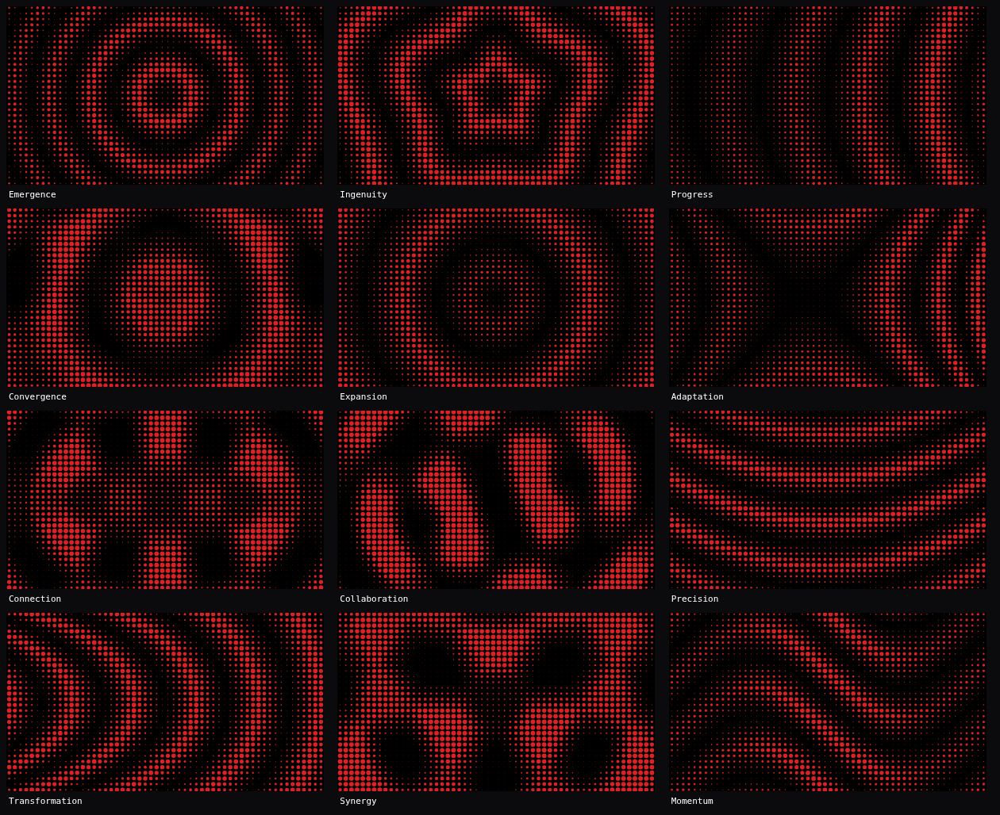

# Dotted Grid Studio

A React tool for making dotted textures. Twelve presets, each a wave — the
description says what the wave does, not what outline it draws — and the wave
sets each dot's size. Download the result as an SVG with a transparent
background and lay it over a photograph.



## Run it

```
open index.html
```

That is the whole setup. There is no build step and no package manager — React
and htm are vendored in `vendor/`, so the page works offline and straight off
the filesystem. To serve it instead:

```
npx http-server -p 8080 .
```

## How a pattern is built

The dots sit on a plain square lattice that never moves, so the texture stays
regular and tiles cleanly. Each preset is one function over the pattern's own
coordinates (`js/fields.js`):

```
density(x, y) -> 0..1     how much light is at this point
```

`js/generate.js` reads that value at each dot and turns it into a radius —
bright means big, dark means small — and optionally drops the dot altogether
where the pattern is dark. So one number carries both size and density, which is
what reads as depth.

The lattice is fixed to the frame; the *pattern* rotates underneath it, which is
why turning the angle never disturbs the grid. Pattern coordinates are folded
back into their own square when tiling, so a small pattern repeats seamlessly
across the frame.

## The twelve patterns

| Preset | Form | Pattern |
|---|---|---|
| Emergence | Emerging core | Rings radiate from one centre, tightening as they travel out. |
| Ingenuity | Soft star | The same rings, pulled into five soft points as they spread. |
| Progress | Directional plume | Bowed wavefronts sweep to the right, opening as they go. |
| Convergence | Gathering field | Ring sources draw inward, their crests gathering at one centre. |
| Expansion | Expanding halo | Rings widen as they travel outward, the crests growing apart. |
| Adaptation | Flowing saddle | Hyperbolic fringes bend through a saddle, rising one way and dipping the other. |
| Connection | Connecting bridge | Two sources interfere, their fringes bridging the gap between them. |
| Collaboration | Interference bloom | Two overlapping wave trains beat into a third, denser rhythm. |
| Precision | Focused lens | Tight parallel bands, bowed just enough to read as a lens. |
| Transformation | Twisted column | Bands turn as they rise, so the grain runs one way above and another below. |
| Synergy | Balanced lobes | Three sources at equal spacing settle into one shared weave. |
| Momentum | Continuous wave | A travelling wave train, its bands oscillating across the frame. |

## Controls

**Dots** — grid density (8–140 dots across the frame), dot size, **size
variation** (how much bigger a crest dot is than a trough dot; at 0 every dot is
the same size), contrast, and scatter, which randomly drops dots out of the
troughs. Keep several dots to a band or the grid beats against the wave.

**Wave** — wave scale (how big the bands are), angle, and the frame shape:
16:9, 1:1, 4:5 or 9:16.

**Colour** — solid dots in `#de2027`, `#687099`, `#c5eef9`, white or black, or
the three-stop gradient `#de2027 → #687099 → #c5eef9`, mapped to dot size,
horizontal, vertical, radial or angular position, and reversible. The background
is transparent by default; black, ink, paper and white are also there.

**Image mode** — optional. Upload an image and its luminance drives dot size
instead of the wave, either on its own or confined inside the wave.

**Export** — SVG (or PNG) at 1200, 2000 or 3200 px wide. With a transparent
background the SVG has no backing rectangle, so it drops straight over a
photograph. Geometry is generated fresh at the export size, so output is
resolution independent and the SVG is true vector circles.

## Layout

```
index.html            loads the vendored libraries, then js/ in order
css/style.css
js/fields.js          the twelve waves
js/color.js           palette, three-stop ramp, gradient mapping
js/generate.js        lattice -> dot list, and the canvas and SVG renderers
js/image.js           luminance sampler for image mode
js/exporters.js       SVG / PNG / JSON download
js/ui.js              canvas, pattern thumbnails, control widgets
js/app.js             state, layout and mount
vendor/               react, react-dom, htm
```

Everything hangs off a single global `DG` namespace, one file per concern.
