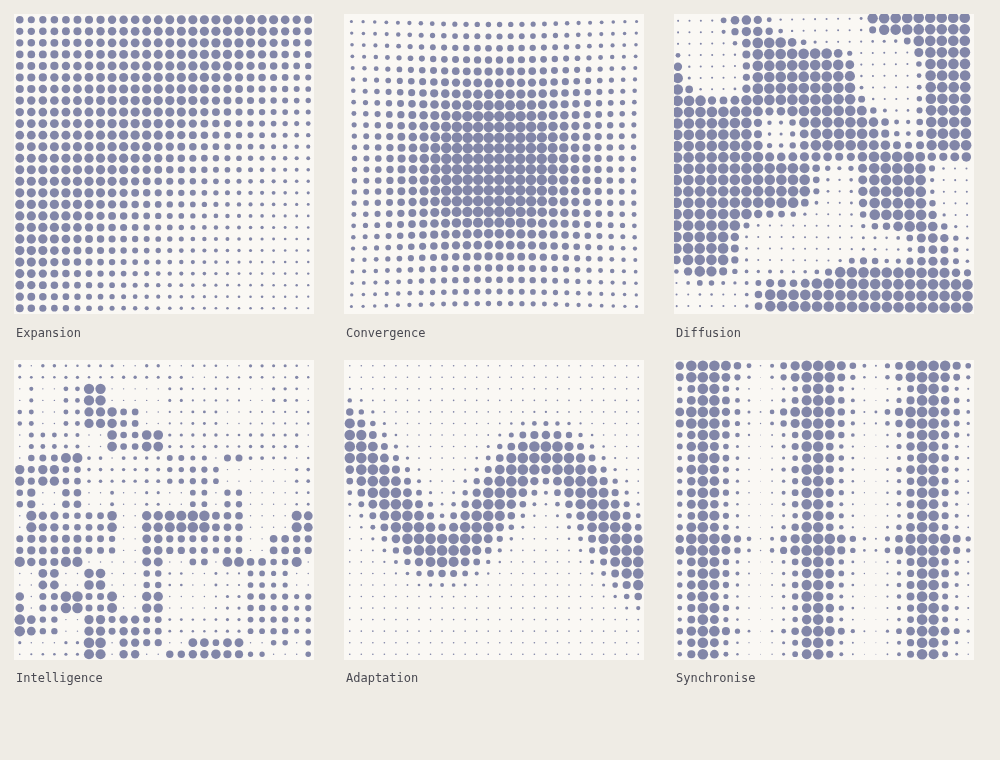

# Dotted Grid Motion

Six dotted patterns in constant flow, with footage export. A companion to the
still branch (`claude/dotted-grid-patterns-wn0ltz`), built motion first.



## Run it

```
open index.html
```

That is the whole setup. There is no build step and no package manager — React
and htm are vendored in `vendor/`, so the page works offline and straight off
the filesystem. To serve it instead:

```
npx http-server -p 8080 .
```

## The six patterns

Six behaviours of one dot system, not six unrelated graphics. The circles are
the base geometry; radius, local spacing and selective absence do the rest.

| Pattern | Emerging form | Motion |
|---|---|---|
| Expansion | A directional field growing from fine grain into visual mass. | A broad swell travels diagonally from the heavy corner. |
| Convergence | A soft central concentration, like a lens or a gravitational well. | The centre inhales — dots swell and draw in, then return. |
| Diffusion | A stable lattice turning porous, opening irregular white channels. | Pockets of empty space migrate; dots shrink away ahead and regrow behind. |
| Intelligence | Clustered information — an abstract circuit, or glyphs that never resolve. | Clusters light up in turn, one gaining as its neighbour recedes. |
| Synchronise | Horizontal signals that drift, lock to a shared beat, and part again. | Pulses travel at one speed but out of phase, align, hold, then separate. |

## How the motion works

Each pattern is a function of place *and time* returning 0..1, and each is
periodic in time with a period of exactly **one cycle** (`js/patterns.js`). The
lattice never moves; the pattern beneath it does, so the motion is carried by
dots swelling and shrinking in turn rather than by anything sliding about.

Periodicity is the whole trick: footage is recorded over a whole number of
cycles, so a ten second file and a one minute file both loop without a jump at
the join. It constrains every animated term — each must complete a whole number
of turns per cycle — and nearly every way it goes wrong is a term completing
half a turn, or a cross-fade easing back to the wrong end. The looping noise is
cross-faded *straight across* for exactly that reason: an eased fade returns to
the layer it left rather than the one it is heading for.

A pattern may also declare `prepare(t, p)` — work done once per frame,
returned as a context. *Convergence* and *Synchronise* resolve their per-frame
state there rather than recomputing it for every dot. Nothing displaces a dot:
a behaviour only decides how much of its cell the dot fills.

## Downloads

**SVG** and **PNG** take the frame showing at the moment you press them — SVG
**with** the background, PNG **without**, so the still drops straight onto
something else.

**GIF** and **MP4** at 10 seconds, 30 seconds or a minute.

GIF is encoded here rather than pulled in (`js/gifenc.js`), so the page keeps
working offline with no worker and nothing to download. A GIF carries at most
256 colours, so frames are quantised: a palette is chosen by median cut over a
sample of the whole run — not just the first frame — and a coarse lookup cube is
filled in once so mapping each pixel afterwards is a single read rather than a
search. Frames are drawn one at a time rather than recorded, so the result does
not depend on the machine keeping up.

Video goes through `MediaRecorder`, which records a live canvas, so **a minute
of footage takes a minute to make**. Feeding frames faster would only produce a
clip that played too fast, since a recorder stamps its frames by the wall clock.
Where the browser can write MP4 it does; where it cannot it writes WebM and the
button says so.

## Controls

**Motion** — speed in cycles per second, pattern scale, and the angle the
pattern runs at. **Dots** — circle or square, grid density, dot size, size
variation, contrast, and scatter. **Colour** — solid dots or the three-stop
brand gradient, and a background that can be transparent, black, ink, red,
slate, ice, paper or white. **Frame** — 16:9, 1:1, 4:5 or 9:16.

## Layout

```
index.html            loads the vendored libraries, then js/ in order
css/style.css
js/patterns.js        the six patterns, as fields that move
js/color.js           palette, three-stop ramp, gradient mapping
js/generate.js        the dots for one moment, and the renderers
js/gifenc.js          the GIF89a encoder
js/record.js          stills, GIF and video
js/ui.js              the animated stage, gallery and control widgets
js/app.js             state, layout and mount
vendor/               react, react-dom, htm
```

Everything hangs off a single global `DG` namespace, one file per concern.
